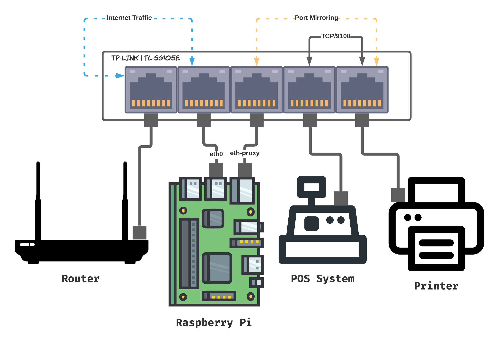

Ethernet Proxy for Raspberry Pi (armhf)   
========

<p align="center">
  
</p>

[](https://github.com/nesto-software/EthernetProxy/actions/workflows/build-binaries.yml)
[](https://github.com/nesto-software/ProxySuite)


Heads Up!
------
This project is currently being refactored by Nesto.   
If you want to participate, feel free to reach out!   
For more information, please visit the [original README](./README.tcpflow.md).

Martin Löper `<martin.loeper@nesto-software.de>`

Development Status
------
<table>

  <tr><th>Variant</th><th>Status</th></tr>
  <tr><td>Software</td><td align="center">:gear:</td></tr>
  <tr><td>Hardware</td><td align="center">:heavy_check_mark:</td></tr>

</table>

The hardware variant runs without any known issues.   
We are currently not actively developing the software variant.
Thus, special hardware which leverages port mirroring is a prerequisite.

Conceptually, the software variant could be implemented using ip forwarding in the Linux kernel, setting up some iptables rules and capturing the packets using this codebase.

Setup
-------

We use the [TL-SG105E V4](https://www.tp-link.com/us/business-networking/easy-smart-switch/tl-sg105e/) for the reference design of our hardware variant. The larger [TL-SG108E V6](https://www.tp-link.com/us/business-networking/easy-smart-switch/tl-sg108e/) works as well.

Make sure to use a separate ethernet port for the capturing interface (eth-proxy) and the interface with internet & LAN access (eth0).
Since the Raspberry Pi 4B has one ethernet interface only, another one is needed. We tested the [Rankie USB Network Adapter](https://www.ijetech.com/product/usb-network-adapter-6421.html/) in this scenario and it appears to work just fine.
<!-- Start tcpflow as follows in order to capture printer traffic over AppSocket/JetDirect: `` -->



#### Port Mirroring
You have to set up port mirroring using the [TL-SG105E's manual](https://www.tp-link.com/us/support/download/tl-sg105e/).
The switch is reachable via *http://192.168.0.1* (user=pw=admin) by default.

Forward traffic from the POS system's port AND/OR the printer's port to the pi's eth-proxy port.

Install via GitHub Releases Download (binary)
---------------------------------------------

| Method    | Command                                                                                           |
|:----------|:--------------------------------------------------------------------------------------------------|
| **curl**  | `bash -c "$(curl -fsSL https://raw.githubusercontent.com/nesto-software/EthernetProxy/master/scripts/install-from-release.sh)"` |
| **wget**  | `bash -c "$(wget -O- https://raw.githubusercontent.com/nesto-software/EthernetProxy/master/scripts/install-from-release.sh)"`   |

Usage
-----

```bash
# 1.) make sure to name the eth-proxy interface correctly, e.g. use ./etc/systemd/network/89-nesto-external-eth.link
# 2.) make sure to bring up the eth-proxy interface, e.g. use ./etc/network/interfaces OR manually using `sudo ifconfig eth-proxy up`

# 3.) start the ethernet proxy binary - you must be root to open the interface in promiscuous mode
sudo DEVICE="eth-proxy" EXPRESSION="tcp and dst port 9100" ethernet-proxy
```

IPC Example
-----------

We provided a sample application for Node.js in the ./nodejs-client folder.

1. Start ethernet-proxy as described above in the usage section
2. Install Node.js binary from nodejs.org or via nvm.
3. Install Node.js dependencies:
```
cd nodejs-client
npm install
```
4. `node ./nodejs-client/index.js`
