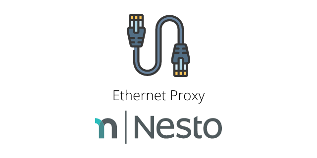

Ethernet Proxy for Raspberry Pi (armhf)   
========

  

Heads Up!
------
This project is currently being refactored by Nesto.   
If you want to participate, feel free to reach out!   
For more information, please visit the [original README](./README.tcpflow.md).

Martin Löper `<martin.loeper@nesto-software.de>`

Development Status
------
<table>

  <tr><th>Variant</th><th>Status</th></tr>
  <tr><td>Software</td><td align="center">:gear:</td></tr>
  <tr><td>Hardware</td><td align="center">:heavy_check_mark:</td></tr>

</table>

The hardware variant runs without any known issues.   
We are currently not actively developing the software variant.
Thus, special hardware which leverages port mirroring is a prerequisite.

Conceptually, the software variant could be implemented using ip forwarding in the Linux kernel, setting up some iptables rules and capturing the packets using this codebase.